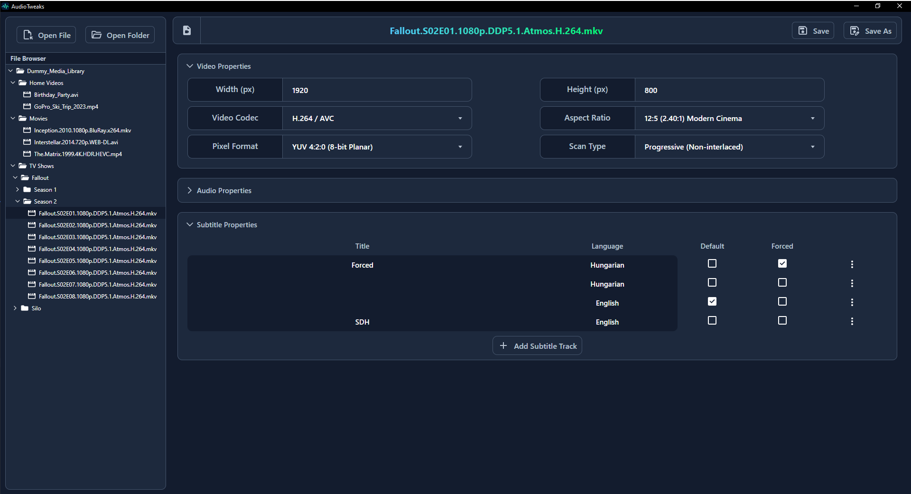
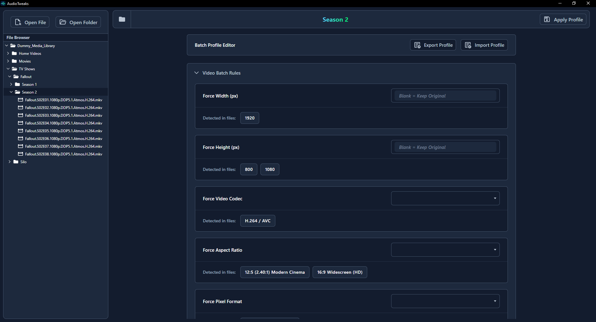
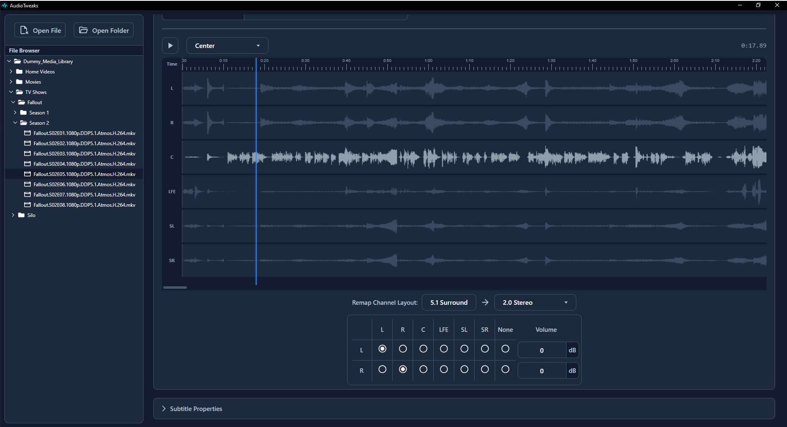

# AudioTweaks

> A lightning-fast, native desktop application for advanced media stream manipulation, metadata editing, and batch processing.

Built with **Tauri**, **Svelte 5**, and powered by **FFmpeg**, AudioTweaks allows you to effortlessly remap audio channels, manage subtitle tracks, and force video profiles without the pain of full re-encoding.

---

## Features

- **Zero-Loss Processing:** Relies on FFmpeg's direct stream copy whenever possible. Edit metadata, strip tracks, and change defaults in seconds, not hours.
- **Advanced Audio Remapping:** A visual matrix to route audio channels (e.g., downmix 7.1.4 Atmos to 5.1), adjust individual channel volumes in dB, and force specific codecs.
- **Native Audio Visualizer:** Instantly decode and visualize audio peaks directly in the UI to inspect tracks before exporting or editing.
- **Batch Profile Engine:** Don't edit files one by one. Build powerful, rule-based profiles (e.g., "Keep ONLY English SDH subtitles", "Force all Video to 16:9") and apply them to entire directories.
- **Subtitle Management:** Import `.srt` files, rename tracks, flag them as Default/Forced, or extract them instantly to your hard drive.
- **Built-in Explorer:** Navigate your file system directly within the app's sleek, dark-mode interface.

---

## Gallery

<div align="center">
  <!-- REPLACE THESE PATHS ONCE YOU TAKE THE SCREENSHOTS! -->
  
  
  <br>
  
  
</div>

---

## Tech Stack

AudioTweaks bridges a blazingly fast Rust backend with a reactive frontend:

- **Frontend:** [Svelte 5](https://svelte.dev/) (using `$state` and `$derived` runes) + HTML/CSS
- **Backend:** [Rust](https://www.rust-lang.org/) + [Tauri v2](https://v2.tauri.app/)
- **Engine:** [FFmpeg](https://ffmpeg.org/) & [FFprobe](https://ffmpeg.org/ffprobe.html) for all media parsing and stream manipulation.

---

## Getting Started

### Prerequisites

1. **Node.js** (v18+)
2. **Rust** and Cargo installed
3. **FFmpeg** installed and added to your system's PATH.

### Installation

1. Clone the repository:

```bash
git clone [https://github.com/yourusername/audio-tweaks.git](https://github.com/yourusername/audio-tweaks.git)
cd audio-tweaks
```

2. Install frontend dependencies:

```bash
npm install
```

3. Run the development server (this will compile the Rust backend and launch the Tauri app):

```bash
npm run tauri dev
```

### Building for Production

To create a standalone, optimized executable for your operating system:

```bash
npm run tauri build
```

The compiled binaries will be available in the src-tauri/target/release directory.

---

## How it Works

Unlike standard video converters that blindly re-encode, AudioTweaks uses an intelligent diffing engine:

1. `ffprobe` scans the file and passes a JSON schema to the Svelte frontend.

2. The UI tracks your modifications (changing titles, ticking "Forced" checkboxes, etc.).

3. The Rust backend receives only the changes and constructs a highly optimized ffmpeg command, utilizing `-c copy` to remux the file.

4. Complex operations, like mapping Channel 3 to Channel 5 with a +10dB boost, are safely translated into precise `-filter:a pan` commands.

---

## Contributing

Contributions, issues, and feature requests are welcome! Feel free to check the issues page.

---

## License

This project is MIT licensed.
